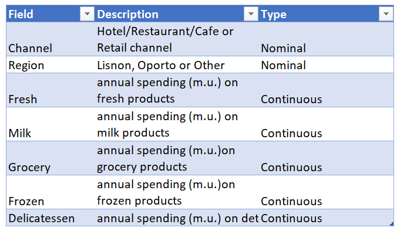
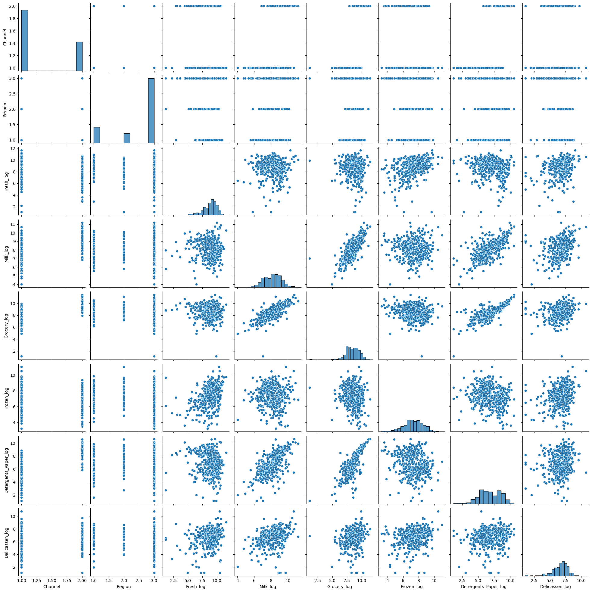
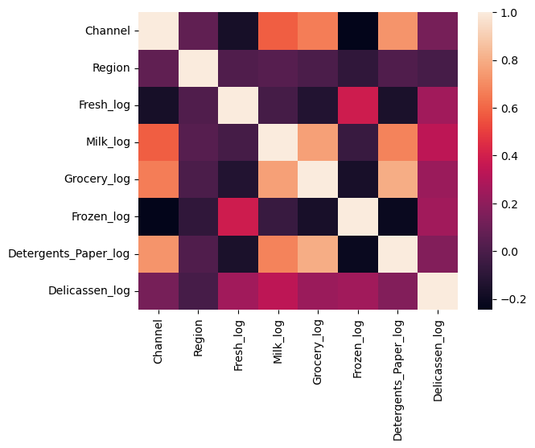
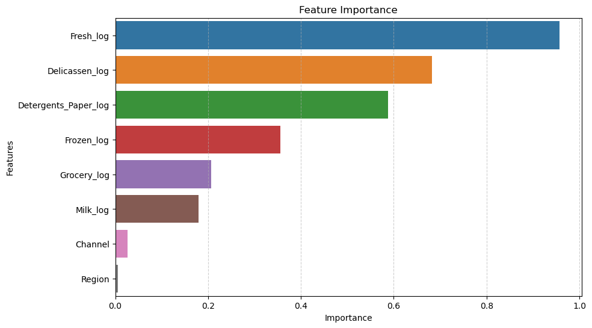
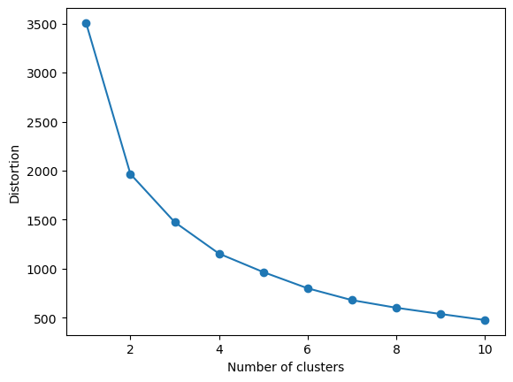
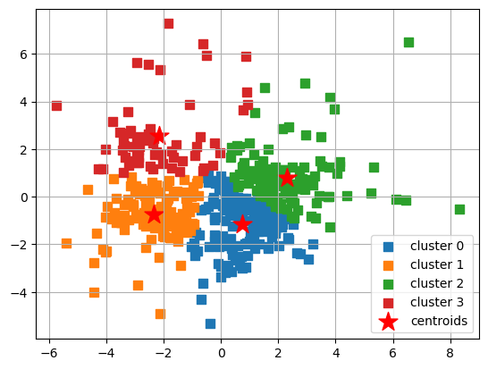
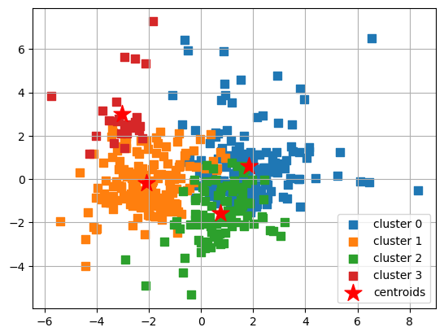
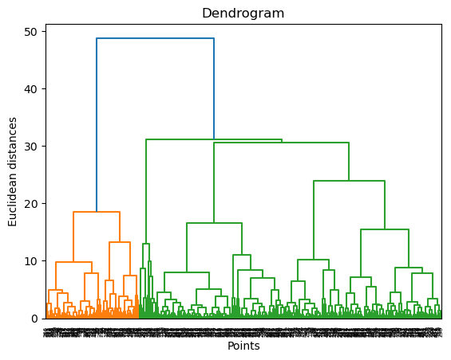
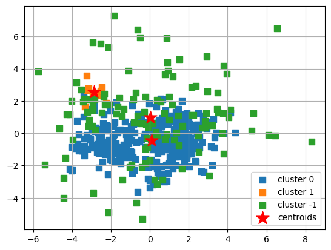

# Understanding Grocery data using Unsupervised learning

## Project Outcomes

- Unsupervised Learning: perform unsupervised learning techniques on a wholesale data dataset. The project involves four main parts: exploratory data analysis and pre-processing, KMeans clustering, hierarchical clustering, and PCA.

## Project Description:

In this project, we will apply unsupervised learning techniques to a real-world data set and use data visualization tools to communicate the insights gained from the analysis.

The data set for this project is the "Wholesale Data" dataset containing information about various products sold by a grocery store.
The project will involve the following tasks:

- Exploratory data analysis and pre-processing: We will import and clean the data sets, analyze and visualize the relationships between the different variables, handle missing values and outliers, and perform feature engineering as needed.
- Unsupervised learning: We will use the Wholesale Data dataset to perform k-means clustering, hierarchical clustering, and principal component analysis (PCA) to identify patterns and group similar data points together. We will determine the optimal number of clusters and communicate the insights gained through data visualization.

The ultimate goal of the project is to gain insights from the data sets and communicate these insights to stakeholders using appropriate visualizations and metrics to make informed decisions based on the business questions asked."

## Approach:

* Part I - EDA - Exploratory Data Analysis & Pre-processing
* Part II - KMeans Clustering
* Part III - Hierarchical Clustering
* Part IV - DBSCAN
* Part V - Conclusion

## I. Exlporatory Data Analysis

The dataset is a grocery sales containing information about various products sold by a grocery store. To perform an exploratory data analysis (EDA) on this dataset, we perform the following tasks:

### Data Cleaning:

* Checked the dataset for any missing or incorrect data and clean the dataset accordingly.

### Data Description:

* Generated summary statistics such as mean, median, and standard deviation for each column of the dataset.

> Data Dictionary:
> 

### Data Visualization:

* Created various visualizations such as histograms, box plots, scatter plots, and heatmaps to understand the relationships and trends between the different variables in the dataset.

> PAIR PLOT:  
> 

### Outlier Detection:

* Checked for any outliers in the dataset and determine whether they are valid or erroneous data points.

### Correlation Analysis:

* Calculated the correlation between different variables in the dataset to determine which variables are highly correlated and which ones are not. For example, we can calculate the correlation between "Grocery" and "Detergents_Paper" to see if there is any relationship between these two variables.

> Correlation Heatmap:  
> 

### Data Transformation:

* Transformed the data by normalizing (log) the variables to make them comparable across different scales.

> Transformed Pair Plot:  
> 

### Feature Selection:

* Identified the most important features or variables that contribute the most to the overall variance in the dataset using Principle Component Analysis.

  **Approach for PCA:**

1. Determine the optimal number of dimensions for the model using the Explained Variance ration as the metric.

2. Perform dimensionality reduction (fit)
3. Confirm the Explained Variance Ratio for the selected dimensions
4. Obtain the PC loadings (coefficients)
5. Rank the Features by importance
6. Visualize Feature importance

> Feature Importance:  
> 

## II - KMeans Clustering

**Elbow Rule**

The tool for deciding how many clusters to choose is the elbow rule in a distortion plot. The data is fitted with various numbers of clusters and stores the distortion

> KMeans - Skree plot  
> 

Optimum Number of CentroidsFrom the above plot and function, we determine the optimum number of centroids is 3. This minimizes the dispersion between the centroids and the data points.

> KMeans Cluster:  
> 

## III - Hierarchical Clustering

_Hierarchical clustering_ is a general family of clustering algorithms that build nested clusters by merging or splitting them successively. This hierarchy of clusters is represented as an upside-down tree (a "dendrogram").

### Approach - Aggolomerative Clustering

The below dendrogram will focus on `Agglomerative clustering`.
It performs a hierarchical clustering using a bottom-up approach: each observation starts in its own cluster, and the clusters are successively merged together.

Agglomerative clusering involves using x,y coordinates (Euclidean) to find the distance between points using Pythagoras (A^2 = B^2 +C^2). We set the Euclidean distance to the `affinity` parameter and set the number of clusters initially to 3 based on the earlier KMeans. Additionally, the parameter (`linkage`) is set to minimize the sum of squared differences within all clusters `ward`.

> Heirarchal Cluster:  
> 
> Dendrogram:  
> 

**General Interpretation of Dendrograms**

__Height:__
The vertical axis (y-axis) of the dendrogram represents the distance or dissimilarity between clusters. The height at which branches merge or split indicates the distance at which clusters were combined or divided.  Lower heights represent closer similarity or smaller distances.

__Cluster Similarity:__
Clusters that merge at lower heights on the dendrogram are more similar to each other in terms of the distance metric used for clustering.
Clusters that merge at higher heights are less similar, and their merger may represent a higher-level grouping.

## IV - DBSCAN

DBSCAN introduces two additional parameters. They are:

* `eps`: The maximum distance between two samples for one to be considered as being in the neighborhood of the other. This is not a maximum bound on the distances of points within a cluster. It is the most important DBSCAN parameter to choose appropriately for our dataset and distance function.
* `min_samples`: The minimum number of samples in a neighborhood for a point to be considered as a core point. This includes the point itself.

> DBSCAN Cluster:  
> 

## V - Conclusion

The Exploratory Data Analysis (EDA), Principle Component Analysis (PCA) and unsupervised learning models lead to the following conclusions about the Grocery data set.

1. Milk & Grocery and Grocery & Detergents appears to be closely correlated in the EDA process. This makes intuitive sense as Grocery is a "broad" category and could be infered to be the primary reason individuals make a trip to a shop. While there, they purchase secondary goods such as milk and detergents.
2. Following PCA, it was found that the most influence was given by Fresh category.Interestingly, neither feature (ie. category) from visual inspection of scatter plots appears as the top-ranked feature in the Principle Component Analysis.
3. KMeans, using 4 clusters provides the cleanest separation amongst the other clustering models in the analysis (Heirarchy, and DBSCAN). DBSCAN was not optimized and may have yeilded better results.
4. KMeans convergence was reached after only 7 interations. It was assumed that more iterations would be required consdering the data
